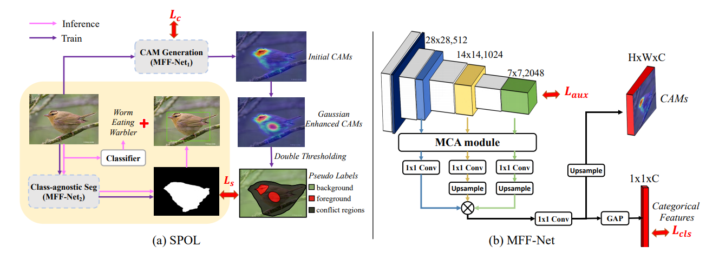
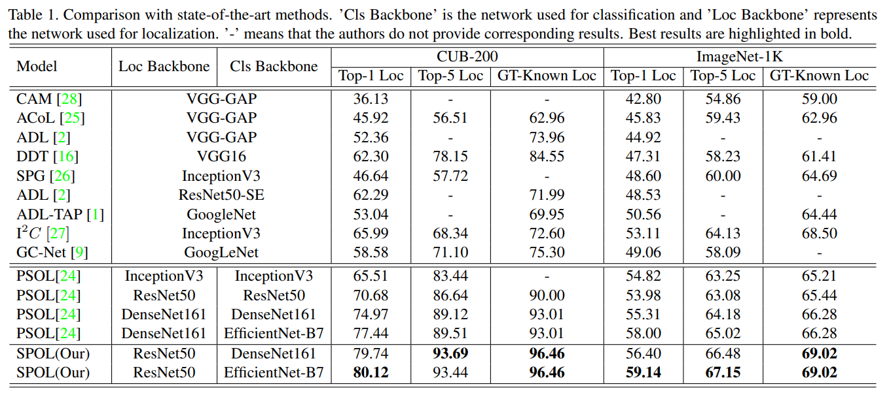
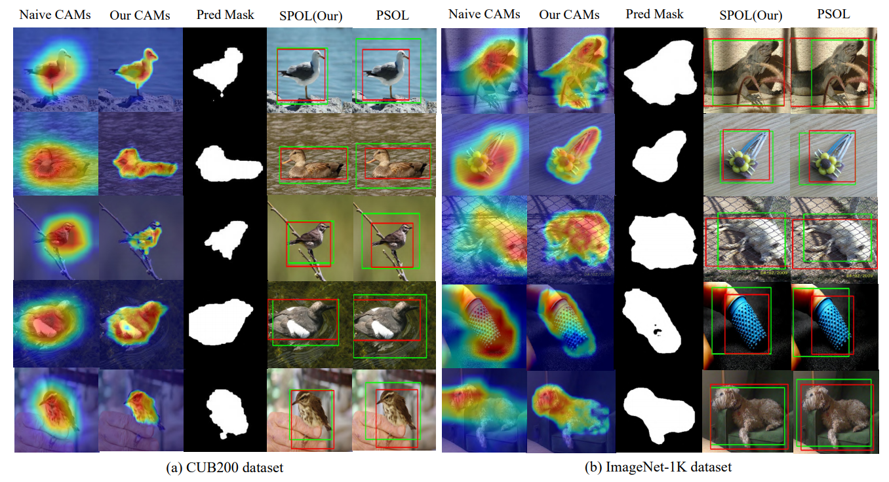

## [Shallow Feature Matters for Weakly Supervised Object Localization](https://openaccess.thecvf.com/content/CVPR2021/papers/Wei_Shallow_Feature_Matters_for_Weakly_Supervised_Object_Localization_CVPR_2021_paper.pdf)
by Jun Wei, Qin Wang, Zhen Li, Sheng Wang, S.Kevin Zhou, Shuguang Cui

## Introduction
Weakly supervised object localization (WSOL) aims to localize objects by only utilizing image-level labels. Class activation maps (CAMs) are the commonly used features to achieve WSOL. However, previous CAM-based methods did not take full advantage of the shallow features, despite their importance for WSOL. Because shallow features are easily buried in background noise through conventional fusion. In this paper, we propose a simple but effective Shallow feature-aware Pseudo supervised Object Localization (SPOL) model for accurate WSOL, which makes the utmost of low-level features embedded in shallow layers. In practice, our SPOL model first generates the CAMs through a novel element-wise multiplication of shallow and deep feature maps, which filters the background noise and generates sharper boundaries robustly. Besides, we further propose a general class-agnostic segmentation model to achieve the accurate object mask, by only using the initial CAMs as the pseudo label without any extra annotation. Eventually, a bounding box extractor is applied to the object mask to locate the target. Experiments verify that our SPOL outperforms the state-of-the-art on both CUB-200 and ImageNet-1K benchmarks, achieving 93.44% and 67.15% (i.e., 3.93% and 2.13% improvement) Top-5 localization accuracy, respectively.


## Clone repository
```shell
git clone https://github.com/weijun88/SPOL.git
cd SPOL/
```

## File tree
```
SPOL
├─cub200-cam
│  └─out
├─cub200-cls
│  └─out
├─cub200-seg
│  └─out
├─dataset
│  ├─CUB_200_2011
│  │  ├─image
│  │  │  ├─001.Black_footed_Albatross
│  │  │  └─002.Laysan_Albatross
│  │  └─mask
│  │      ├─001.Black_footed_Albatross
│  │      └─002.Laysan_Albatross
│  └─ImageNet2012
│      ├─box
│      ├─train
│      │  ├─n01440764
│      │  └─n01443537
│      └─val
├─imagenet-cam
│  └─out
├─imagenet-cls
├─imagenet-seg
│  └─out
├─network
├─resource
└─utils
```


## Prerequisites
- [Python 3.8](https://www.python.org/)
- [Pytorch 1.8](http://pytorch.org/)
- [OpenCV 4.5](https://opencv.org/)
- [Numpy 1.21](https://numpy.org/)
- [Albumentations 0.5](https://github.com/albumentations-team/albumentations)
- [Apex](https://github.com/NVIDIA/apex)


## Download dataset
- Download the following datasets and unzip them into `dataset` folder
    - [CUB-200-2011](http://www.vision.caltech.edu/visipedia/CUB-200.html)
    - [ImageNet-1K](https://image-net.org/)


## Download model
- If you want to evaluate the performance of SPOL, please download our trained model
    - CUB-200-2011: [Baidu: tjtn](https://pan.baidu.com/s/17Or64638LaAAGKCNA7zV_g) | [Google](https://drive.google.com/file/d/1jiVhHD2eHsSKwfQ9FFv5rcC7w4lJvlka/view?usp=sharing) , put it into the folder `cub200-seg/out`
    - ImageNet-1K: [Baidu: poz8](https://pan.baidu.com/s/1oB5CxybU73tiqZYaOpX5-Q) | [Google](https://drive.google.com/file/d/1QLMh0DXdUeD51dtl6iTGtiVFauorHN5p/view?usp=sharing): , put it into the folder `imagenet-seg/out`
- If you want to train your own model, please download the [pretrained model](https://download.pytorch.org/models/resnet50-19c8e357.pth) into `resource` folder


## Training and Testing for CUB-200-2011
```python
    cd cub200-cls
    python3 train.py        # train the classification model
    python3 test.py         # keep the classification result to top1top5.npy
    
    cd ../cub200-cam        
    python3 train.py        # train the CAM model
    python3 test.py         # keep the pseudo masks

    cd ../cub200-seg        
    python3 train.py        # train the segmentation model
    python3 test.py         # evaluate the localization accuracy
```


## Training and Testing for ImageNet-1K
```python
    cd imagenet-cls
    python3 test.py         # keep the classification result to top1top5.npy
    
    cd ../imagenet-cam        
    python3 train.py        # train the CAM model
    python3 test.py         # keep the pseudo masks

    cd ../imagenet-seg        
    python3 train.py        # train the segmentation model
    python3 test.py         # evaluate the localization accuracy
```

- If you only want to evaluate the model performance, please download the our traind model, as above mentioned. And execute the following codes.
```
    cd cub200-seg
    python3 test.py         # evaluate the model performance about cub-200-2011

    cd imagenet-seg
    python3 test.py         # evaluate the model performance about ImageNet-1k
```

## Quantitative comparisons 


## Qualitative comparisons 


## Citation
- If you find this work is helpful, please cite our paper
```
@InProceedings{Wei_2021_CVPR,
    author    = {Wei, Jun and Wang, Qin and Li, Zhen and Wang, Sheng and Zhou, S. Kevin and Cui, Shuguang},
    title     = {Shallow Feature Matters for Weakly Supervised Object Localization},
    booktitle = {Proceedings of the IEEE/CVF Conference on Computer Vision and Pattern Recognition (CVPR)},
    month     = {June},
    year      = {2021},
    pages     = {5993-6001}
}
```
